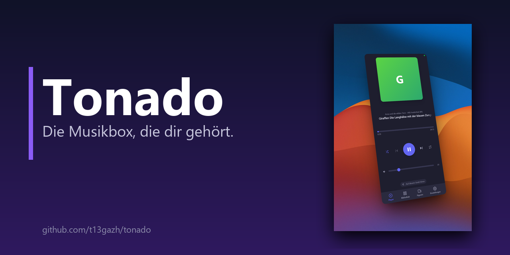
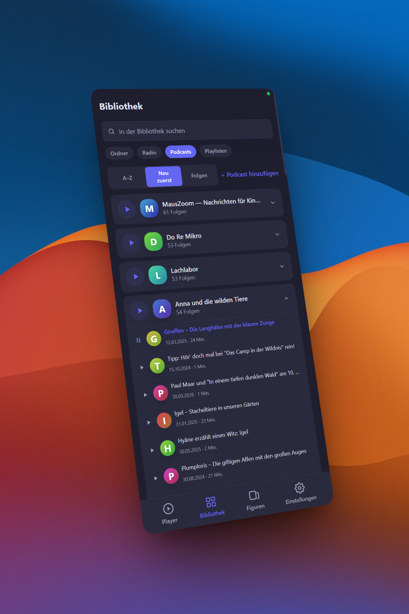
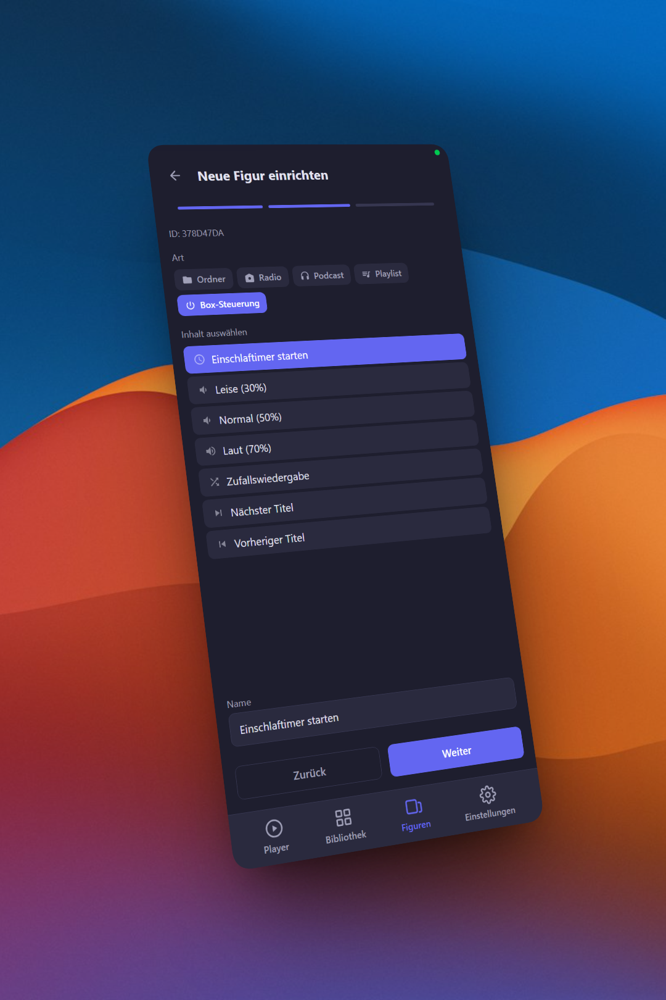
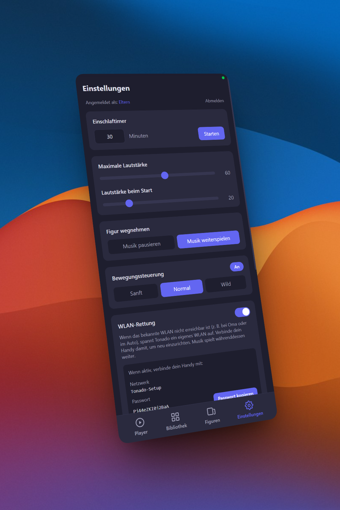
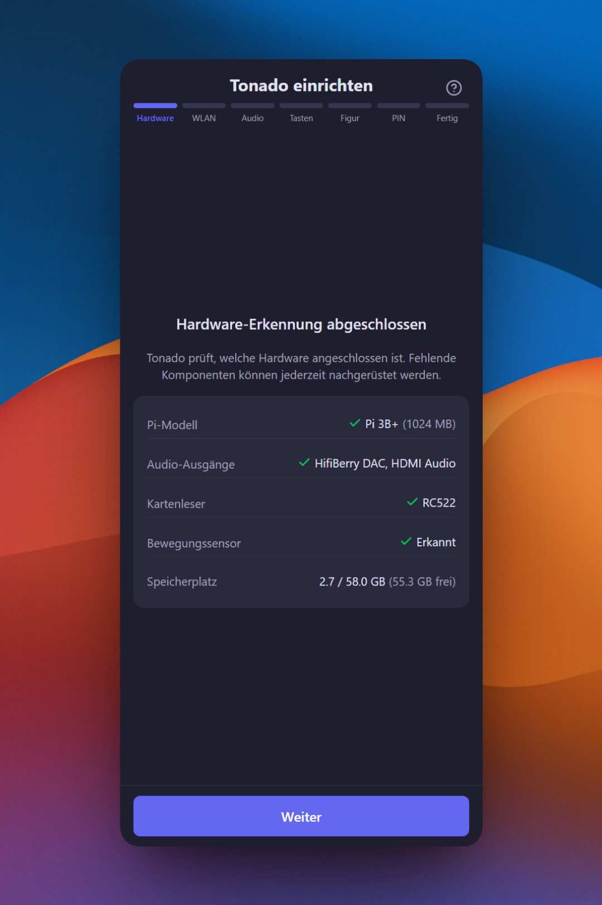
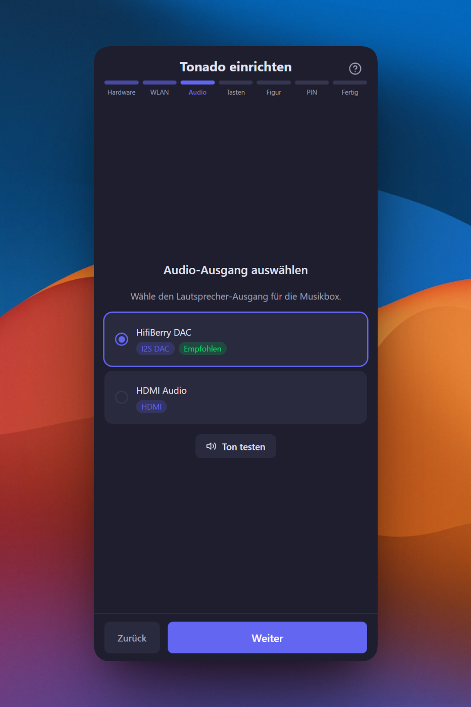
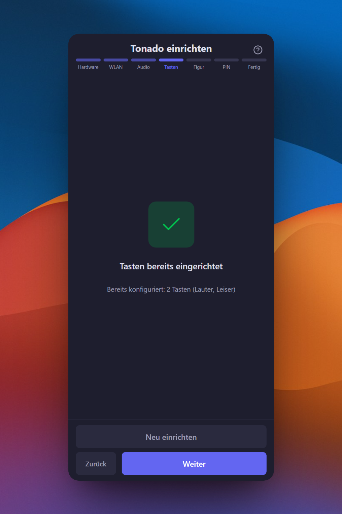

# Tonado

> Die Musikbox, die dir gehört.

[](LICENSE)
[](CHANGELOG.md)
[](docs/fuer-bastler/hardware.md)
[](https://svelte.dev)
[](https://fastapi.tiangolo.com)
[](CONTRIBUTING.md)

Open-Source Kinder-Musikbox mit Figuren und Karten, gesteuert vom Smartphone. Raspberry Pi basiert, kein Abo, keine Cloud, keine Limits.

Jede Figur oder Karte enthält einen kleinen RFID-Chip (13.56 MHz), den die Box beim Auflegen erkennt. Ab hier im Text nur noch „Figur".



## Features

- **Figur auflegen, Musik spielt** — Kinder legen eine Figur oder Karte auf, der Rest passiert von allein
- **Smartphone als Fernbedienung** — Musik verwalten, Figuren zuweisen, Lautstärke begrenzen, Einschlaftimer setzen
- **Eigene Musik, eigene Regeln** — MP3s hochladen, Internetradio, Podcasts — alles auf deinem Pi, nichts in der Cloud
- **Kindersicher** — PIN-geschützte Eltern-Einstellungen, maximale Lautstärke, automatischer Einschlaftimer
- **Gesten-Steuerung** — Box kippen zum Skippen, schütteln für Shuffle (optional, mit Gyro-Sensor)
- **Physische Tasten** — Lautstärke, Play/Pause, Skip per Knopfdruck — automatisch erkannt, kein Pin-Wissen nötig
- **Open Source** — MIT-Lizenz, vollständig anpassbar, keine versteckten Kosten

## So sieht es aus

Die App läuft im Browser auf deinem Smartphone, Tablet oder Laptop — kein App-Store, keine Installation.

| Bibliothek | Figur einrichten | Eltern-Einstellungen |
|:---:|:---:|:---:|
|  |  |  |

**Setup-Wizard — kein Terminal, keine Config-Datei:**

| Hardware erkennen | Audio-Ausgang | Tasten einlernen |
|:---:|:---:|:---:|
|  |  |  |

## Was du brauchst

| Komponente | Beispiel | ca. Preis |
|---|---|---|
| Raspberry Pi | Zero W, 3B+, 4 oder 5 | 15–50 € |
| microSD-Karte | mind. 16 GB, Class 10 | 8 € |
| Lautsprecher | HifiBerry MiniAmp + kleiner Lautsprecher | 15–25 € |
| RFID-Reader | RC522 (SPI) oder USB-RFID-Reader | 5–10 € |
| Figuren oder Karten | 13.56 MHz RFID-Chips (MIFARE Classic o.ä.) | 5 € / 10 Stk |
| USB-Netzteil | 5V, passend zum Pi-Modell | 10 € |
| **Optional:** Gyro-Sensor | MPU6050 — für Gesten-Steuerung | 3 € |
| **Optional:** Tasten | Arcade Buttons o.ä. — für Lautstärke, Skip | 5 € |
| **Optional:** Ein/Aus-Taster | OnOff SHIM — sauberes Hoch-/Herunterfahren | 8 € |
| **Optional:** Gehäuse | 3D-Druck, Holzbox, Brotdose, ... | variabel |

**Gesamtkosten: ca. 70–100 €** — eigene Musik, kein Abo, keine laufenden Kosten.

Alle Details zu Modellen, Optionen und Verkabelung: **[Hardware-Anleitung](docs/fuer-bastler/hardware.md)**

## Schnellstart

### 1. SD-Karte vorbereiten

1. [Raspberry Pi Imager](https://www.raspberrypi.com/software/) installieren
2. **Raspberry Pi OS Lite** auswählen (64-bit, oder 32-bit für Pi Zero W)
3. In den Einstellungen: Hostname, SSH, WLAN, Benutzername `pi` konfigurieren
4. Image auf SD-Karte schreiben

### 2. Tonado installieren

Per SSH auf dem Pi einloggen und einen Befehl ausführen:

```bash
ssh pi@<hostname>.local
curl -sSL https://raw.githubusercontent.com/t13gazh/tonado/main/system/install.sh | sudo bash
```

Das Script erledigt alles automatisch — Pakete, Audio, RFID, Webserver. Dauert 5–15 Minuten je nach Pi-Modell. Falls ein Neustart nötig ist: `sudo reboot`

### 3. Loslegen

Browser öffnen, `http://<hostname>.local` aufrufen, Musik hochladen, Figuren zuweisen — fertig.

Ausführliche Anleitung mit Troubleshooting: **[Installationsanleitung](docs/fuer-bastler/installation.md)**

## Aktualisierung

Über die App: **Einstellungen > System > Nach Updates suchen**

Oder per SSH:

```bash
cd /opt/tonado && sudo -u pi git pull && sudo systemctl restart tonado
```

## Für Entwickler

Tonado ist gebaut mit **Svelte 5**, **FastAPI**, **MPD** und **SQLite**. Hardware-Services laufen auf Windows/Mac im Mock-Modus.

Entwicklungsumgebung, Tests, Deployment: **[Entwickler-Anleitung](docs/fuer-entwickler/entwicklung.md)**

## Status

> **Beta (v0.3.0)** — Installierbar und funktionsfähig auf Pi 3B+ und Pi Zero W. Die Ersteinrichtung ist aktuell nur für technik-affine Eltern (SSH + `curl | sudo bash`). Ein Pi-Image zum direkten Flashen, das auch nicht-technische Eltern bedienen können, ist das nächste Ziel nach Beta. [Changelog](CHANGELOG.md) · [Install-Strategie](docs/fuer-entwickler/install-strategy.md)

**Implementiert:** Player, Bibliothek mit Ordnern/Radio/Podcasts/Playlisten, Figuren-Wizard, Eltern-Einstellungen (PIN, Lautstärkelimit, Sleep-Timer mit Fade-Out), PIN-geschützter Bibliothek-Zugriff, Hardware-Erkennung (RC522/PN532/USB), Gesten-Steuerung, interaktive GPIO-Button-Erkennung, Setup-Wizard (6 Schritte, Re-Run-sicher), Error-Boundaries mit globalem Toast-System, Audio-Testton im Wizard, Hardware Graceful Degradation, Browser-Audio, automatische Updates, Backup/Restore.

**Pi-Kompatibilitätsmatrix (Stand 2026-04-17):**

| Modell | Status | Hinweise |
|--------|--------|----------|
| Raspberry Pi 3B+ | ✅ Beta-getestet | Referenz-Plattform. HifiBerry MiniAmp + RC522 + MPU6050 + GPIO-Buttons verifiziert. |
| Raspberry Pi Zero W | ✅ Beta-getestet | Install-Script End-to-End auf 4 GB Bookworm-Lite SD verifiziert (2026-04-22). Backend-Idle: CPU 40 °C, RAM 160/427 MB. Erster Build 20-30 min wegen aiosqlite-Kompilierung auf ARMv6. |
| Raspberry Pi Zero 2 W | ⚠️ Experimentell | Nicht getestet, sollte aber ähnlich Pi 3B+ laufen (ARM64). |
| Raspberry Pi 4 | ❓ Ungetestet | Sollte funktionieren — Rückmeldungen willkommen. |
| Raspberry Pi 5 | ❓ Ungetestet | Neuer GPIO-Controller (RP1); gpiod v2 sollte abstrahieren, nicht verifiziert. |

**Performance (Pi 3B+):** API-Responses 15–25 ms, 50 MB RAM, 10s Startup, 1.3 MB Frontend.

**Known Issues:**
- **Captive-Portal-Setup noch nicht mit nicht-technischer Zielgruppe getestet.** Pi aus dem Karton → AP → WLAN einrichten läuft lokal, wurde aber nicht mit einem „frischen" Anwender validiert.

**Was noch fehlt:** Fertiges Image zum Flashen (aktuell Install-Script), PN532- und USB-RFID-Reader-Tests, Performance-Optimierung (Health-Endpoint, CPU-Idle-Last), Mehrsprachigkeit (Englisch vorbereitet).

## Dokumentation

Die Doku ist nach Zielgruppe sortiert:

- **Für Eltern** — [Erste Schritte](docs/fuer-eltern/ERSTE-SCHRITTE.md) · [Vision](docs/VISION.md) · [Was Tonado kann](docs/fuer-eltern/features.md) · [Häufige Fragen](docs/fuer-eltern/FAQ.md) · [Updates](docs/fuer-eltern/UPDATE.md) · [Backup](docs/fuer-eltern/BACKUP.md)
- **Für Bastler** — [Installation](docs/fuer-bastler/installation.md) · [Hardware](docs/fuer-bastler/hardware.md)
- **Für Entwickler** — [Mitmachen](CONTRIBUTING.md) · [Architektur](docs/fuer-entwickler/ARCHITEKTUR.md) · [Entwicklung](docs/fuer-entwickler/entwicklung.md) · [Roadmap](docs/fuer-entwickler/ROADMAP.md) · [Install-Strategie](docs/fuer-entwickler/install-strategy.md)

## Mitmachen

- **Testen:** Probier Tonado aus und melde Probleme als [Issue](https://github.com/t13gazh/tonado/issues)
- **Hardware testen:** Wir suchen Tester mit Pi 4/5, PN532 (I2C) und USB-RFID-Readern
- **Übersetzen:** Tonado ist auf Deutsch — Hilfe bei weiteren Sprachen willkommen (`web/src/lib/i18n/`)

## Inspiration

*Inspiriert von großartigen Open-Source-Projekten wie [Phoniebox](https://github.com/MiczFlor/RPi-Jukebox-RFID) und [TonUINO](https://www.voss.earth/tonuino/) — und der Idee, dass Kinderzimmer keine Cloud-Anbindung brauchen.*

## Lizenz

MIT License — siehe [LICENSE](LICENSE)
